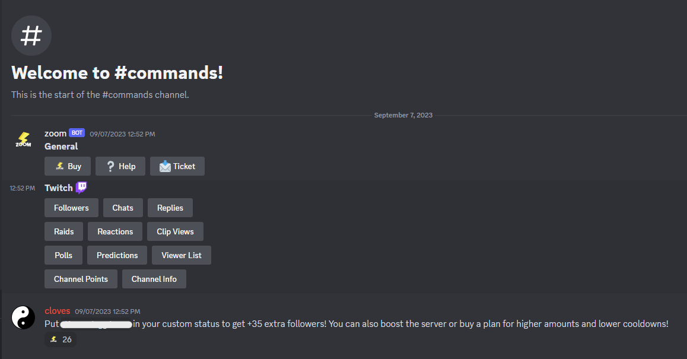

# 🌌 zoom-autobot
Simple discord selbot to automatically interact with zooms twitch follow bot. With this bot at current rates you can get 60 follows per 9 minutes which if hosted 24/7 you will farm 400/h and 9,600/day **[*](https://github.com/IMXNOOBX/zoom-autobot#note)**

# 🛸 Usage
1. Rename `.env.template` to `.env` and write in there your parameters
2. Install all the packages with `npm install`
3. Run `node index.js` to execute the bot
* ❕ You might want to check if channel id's are the same ones in the server just in case

# 🚨 Warning
* You might be manually banned after few weeks, use it at your own risk (wich isn't much as you can create more accounts easily) 
* Using selfbots its against discord [tos](https://discord.com/terms)

#### note
The bot doesn't store which account have already follow you so it might send follow request with accounts that already follow you so the rates will be much lower, i can't do anything but suggest the zoom bot developer to improve the bot.

#### for the developer
If you are the zoom bot developer and want to contact me regarding this project, you can do so through Discord. This project isn't meant to annoy you or damage your project in any way. The purpose of this bot is to automate the usage of the free trial of the bot.
